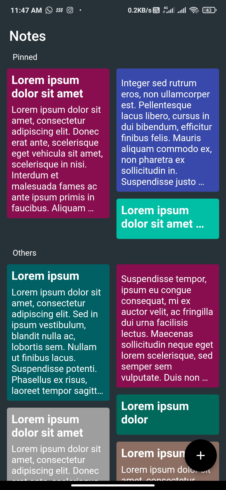
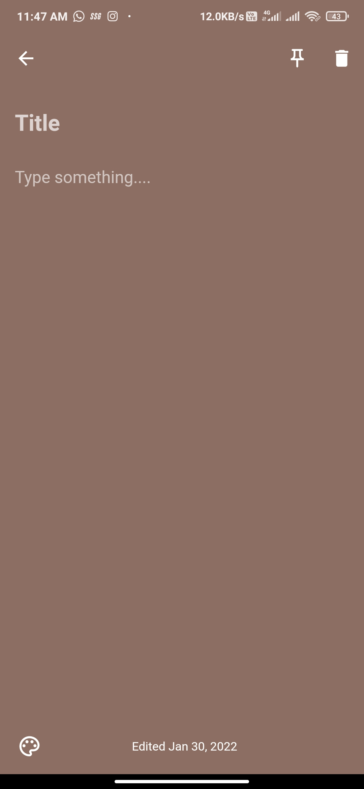
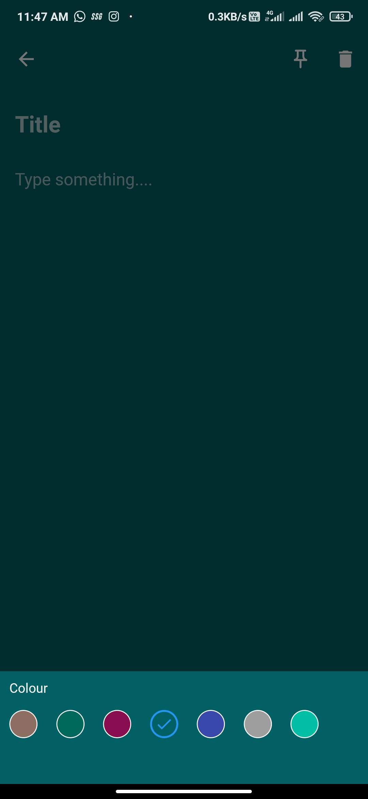
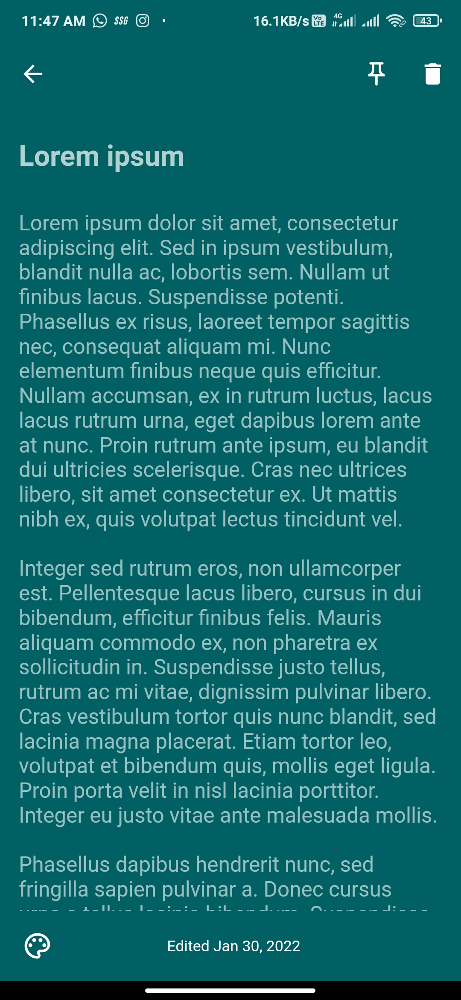

# notes

Notes app employing the sqlite (database) package with bifurcated section for pinned/important notes.
 
 

## Home Screen

 

Notes app home page with bifurcated section for pinned/important notes and a floating button for new notes. The notes are ordered by their date of creation.

 
 
 
 
 
 
 
 
 
 
 
 
 
 
 
 

## Note

 

 
 
 
  
  
 
New note with default brown color, delete and pin buttons at the top, and color palette at the bottom navigation bar along with the created time. Color palette in the bottom modal section.

